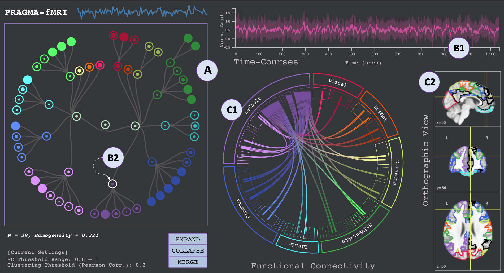
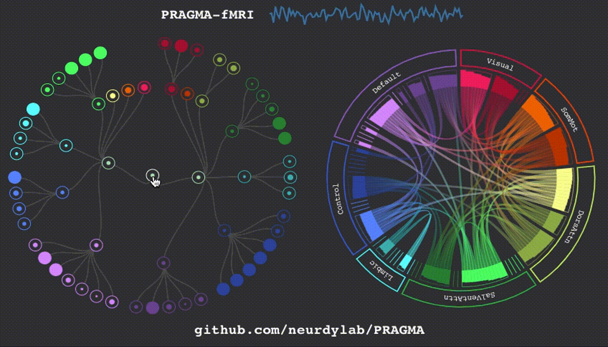

# PRAGMA
## Interactively Constructing Functional Brain Parcellations


Public source code repo for **PRAGMA: Interactively Constructing Functional Brain Parcellations** paper, which was accepted to [IEEE VIS 2020](http://ieeevis.org/year/2020/info/papers-sessions), 

🏅**Best Short Paper Honorable Mention**.






If you find this code helpful in your research please cite the following paper:

```
Bayrak, Roza G., Nhung Hoang, Colin B. Hansen, Catie Chang, and Matthew Berger. "PRAGMA: Interactively Constructing Functional Brain Parcellations." arXiv preprint arXiv:2009.01697 (2020).
```

The paper can be found [here](https://arxiv.org/abs/2009.01697).

**Abstract**: A prominent goal of neuroimaging studies is mapping the human brain, in order to identify and delineate functionally-meaningful regions and elucidate their roles in cognitive behaviors. These brain regions are typically represented by atlases that capture general trends over large populations. Despite being indispensable to neuroimaging experts, population-level atlases do not capture individual or state-dependent differences in functional organization. In this work, we present an interactive visualization method, PRAGMA, that allows domain experts to derive scan-specific parcellations from established atlases. PRAGMA features a user-driven, hierarchical clustering scheme for defining temporally correlated parcels in varying granularity. The visualization design supports the user in making decisions on how to perform clustering, namely when to expand, collapse, or merge parcels. This is accomplished through a set of linked and coordinated views for understanding the user's current hierarchy, assessing intra-cluster variation, and relating parcellations to an established atlas. We assess the effectiveness of PRAGMA through a user study with four neuroimaging domain experts, where our results show that PRAGMA shows the potential to enable exploration of individual/state-specific brain parcellations and to offer interesting insights into functional brain networks.

## Quick Start
#### d3 notebook
Observable notebook [here](https://observablehq.com/d/0a3780675484b524)
#### Get our docker image
```
sudo docker pull rgbayrak/pragma
```

Authors of this code:
- Roza G. Bayrak ([email](mailto:roza.g.bayrak@vanderbilt.edu))
- Nhung Hoang ([email](mailto:nhung.hoang@vanderbilt.edu))
- Colin B. Hansen ([email](mailto:colin.b.hansen@vanderbilt.edu))


